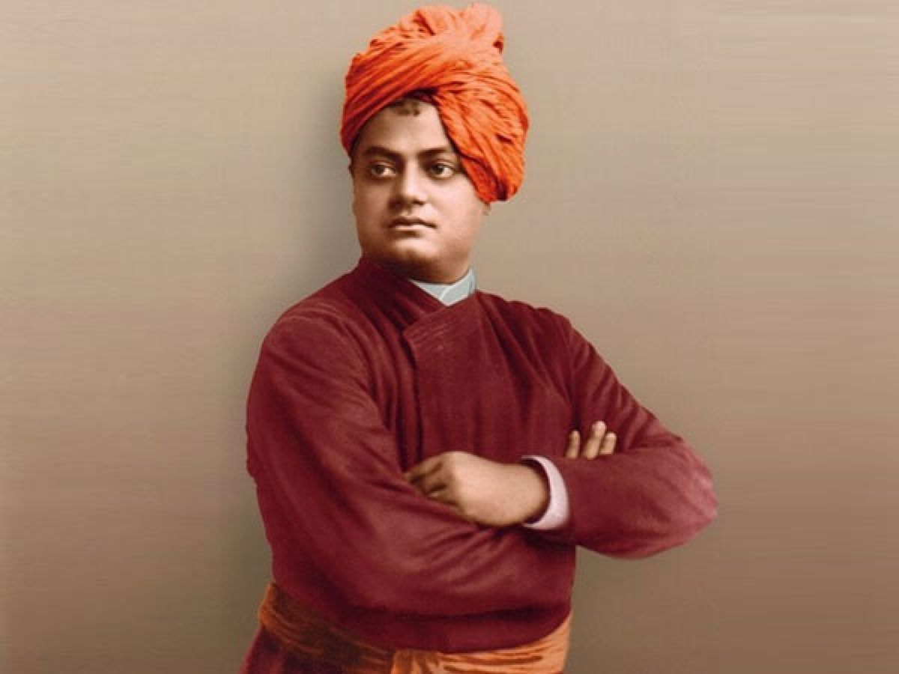

# html-css-project-1
<!DOCTYPE html>
<html lang="en">
<head>
    <meta charset="UTF-8">
    <meta name="viewport" content="width=device-width, initial-scale=1.0">
    <title>The Tribute Website | A.P.J Abdul Kalam</title>
    <link rel="stylesheet" href="Tribute.css"/>
</head>
<body>
    

        

            <section class="top_section">
                

                    
                

                

                    <h1>SWAMI VIVEKANANDA</h1>
                    <h4>1863-1902</h4>
                

            </section>
            <section class="about_section">
                <h2>INSPIRATION</h2>
                
<b>Swami Vivekananda </b>(12 January 1863- 4 July 1902) was the foremost disciple of Sri Ramakrishna and a world spokesperson for Vedanta. His lectures, letters and poems are published as The Complete Works of Swami Vivekananda. Swamiji, as Vivekananda is affectionately known, believed it was best to teach universal principles rather than personalities. Therefore, his teaching and writing focus on Vedanta philosophy and not Sri Ramakrishna.

Vivekananda represented Hinduism at the 1893 World’s Parliament of Religions convened during the World’s Columbian Exposition in Chicago. With his opening words, “Sisters and brothers of America”, Swamiji brought the crowd to its feet. Subsequently he was invited to speak all over America and Europe. In fact, most Vedanta Societies which were founded in America and Europe up through the 1930s can trace their origins directly to Vivekananda or the people who heard him speak from 1893 through 1900.

After his first visit to the West, Swami Vivekananda went back to India and founded the Ramakrishna Order at Belur outside of Kolkata in 1898. When he returned to the United States a few years later, he was accompanied by his brother monk Swami Turiyananda. Other brother disciples of Sri Ramrakrishna, Swamis Saradananda and Abhedananda,  followed Swamiji and taught widely.

Vivekananda was a man with a great spiritual presence and tremendous intellect who was a tireless teacher and writer. He wrote poems and hymns in Bengali, English and Sanskrit, some of which are sung daily in Vedanta centers worldwide. He was ahead of his time in encouraging women and Westerners to not only practice Vedanta, but to be leaders. Two examples are Sara Ellen Waldo who recorded and collected Swamiji’s talks at Thousand Island Park and Margaret Noble, later known as Sister Nivedita, who devoted her life not only to Vedanta but also to the education of Indian girls. The Master as I Saw Him is her account of the years she knew Swamiji.  Vivekananda initiated both women as a sannyasini and brahmacharini respectively, a radical act for the time.

Vivekananda’s main teaching in the West, and in India for that matter, is Practical Vedanta. By this the Swami stressed that religion needs to be intensely practical and carried into all areas of our lives. The primary message of Vedanta is one of oneness and that our human purpose is to realize our divine nature. Through his teachings on the four yogas, the harmony of religions, divinity of the soul, and serving humanity as God, Vivekananda gave spiritual aspirants paths to that realization. The Swami also made major contributions  to both world culture and Indian culture.

            </section>
        

        <section class="biography_section">
            <h3>Biographies</h3>
            <ul>
                <li>
                  The Life of Swami Vivekananda by  His Eastern and Western Disciples; Publisher:Advaita Ashrama , 1949.   
                </li>
                <li>
                    Vivekananda: A Biography by Swami Nikhilananda; Publisher: Advaita Ashrama, 2010.
                </li>
                <li>
                     Swami Vivekananda: The Living Vedanta by Chaturvedi Badrinath;Penguin Books Publisher, 2015.
                </li>
                <li>
                    Swami Vivekananda: A Reassessment by Narasingha P. Sil; Publisher: Susquehanna University Press, March 1,1997.
                </li>
                <li>
                     Swami Vivekananda: Messiah of Resurgent India by  P. R. Bhuyan; Publisher: Atlantic Publishers & Distributors, June 21,2003.
                </li>
                
            </ul>
        </section>
        <footer>
Read more about Swami Vivekananda on <a href="https://en.wikipedia.org/wiki/Swami_Vivekananda" target="_blank">Wikipedia.</a>
</footer>
    

</body>
</html>
*{
    margin: 0;
    margin: 0;
    box-sizing: border-box;
}
.container{
    background-color: #e5e5fd ;
    min-height: 100vh;
    border: 10px solid #1d1e4c;
}
.content{
    max-width: 900px;
    margin:0 auto;
}
.top_section h1{
    font-size: 50px;
    font-weight:bold;
    color: #1d1e4c;
    text-transform: uppercase;
   
      
}
.top_section{
    margin-top: 100px;
    display: flex;
    justify-content: space-between;
    align-items: flex-end;
}
.top_section h4
{
    font-size: 20px;   
    text-align: end;
}
.image_container{
    border-radius: 50%;
    overflow: hidden;
}
.image_container,img{
    width: 300px;
    height: 200px;
}
.about_section{
    margin-top: 50px;
}
.about_section h2{
    font-size: 70px;
    font-weight: 400px;
    margin-bottom: 20px;
}
.about_section p{
    font-size: 20px;
    line-height: 30px;
    letter-spacing: 1.2px;
    text-align: justify;
}
.biography_section{
    margin: 50px 0;
}
.biography_section h3{
    margin-bottom:20px;
    margin-left: 170px;

}
.biography_section ul{
    margin-left: 170px;
}
.biography_section l1{
    margin-bottom: 15px;
}
footer{
    margin: 50px 0;

}
footer p{
    text-align: end; 
}
